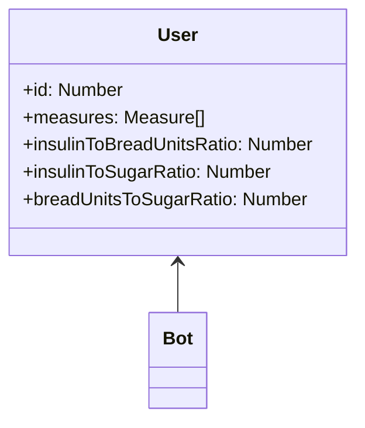

# Telegram-bot for diabetics

```mermaid
classDiagram
class User {
    +id: Number
    +measures: Measure[]
    +insulinToBreadUnitsRatio: Number
    +insulinToSugarRatio: Number
    +breadUnitsToSugarRatio: Number
}
User <-- Bot
```
